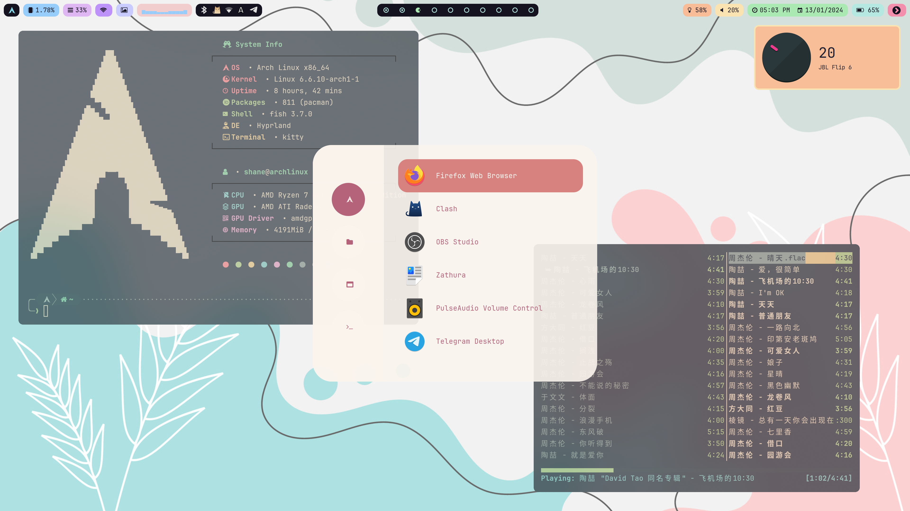
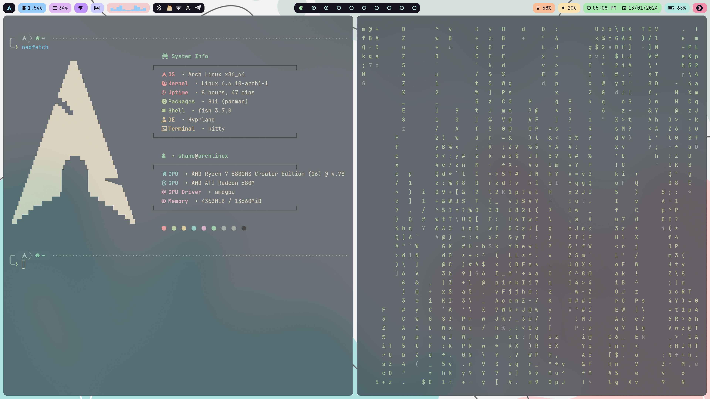

# Screen Shots

# 系统组件
- network-manager-applet
- bluez	
- bluez-utils	
- blueman
- cliphist 
- brightnessctl
- pavucontrol
- pamixer

# sddm 主题
- qt5-quickcontrols 
- qt5-graphicaleffects
- [sddm-chili](https://github.com/MarianArlt/sddm-chili)

# [功耗控制](https://arch.icekylin.online/guide/advanced/power-ctl.html)
- tlp 
- tlp-rdw

# 系统信息
- neofetch

# 字体
- ttf-jetbrains-mono-nerd
- ttf-font-awesome
- noto-fonts-cjk
- noto-fonts-emoji

# 壁纸
- swww
- [wallpaper switcher](https://github.com/JaKooLit/wallpaper-switcher)

# 输入法
- fcitx5-im
- fcitx5-rime
- [雾凇拼音](https://github.com/iDvel/rime-ice)
- fcitx5-material-color

# pdf 阅读器
- zathura
- zathura-pdf-mupdf
- zathura-djvu

# 截图
- slurp
- grim

# 浏览器
- firefox

# 文件浏览器
- Thunar
- [Yazi](https://github.com/sxyazi/yazi)

# 编辑器
- neovim
    - [NvChad](https://nvchad.com/docs/quickstart/install)
    - [lastplace](https://github.com/ethanholz/nvim-lastplace)
    - [markdown preview](https://github.com/iamcco/markdown-preview.nvim)
    - [vimtex](https://github.com/lervag/vimtex)
    - [img-paste](https://github.com/img-paste-devs/img-paste.vim)

# 音乐
- ncmpcpp
- mpd

# 启动器
- rofi-lbonn-wayland-git

# 状态栏
- waybar

# 终端
- fish
    - [fisher](https://github.com/jorgebucaran/fisher)
    - [z](https://github.com/jethrokuan/z)
    - [autols](https://github.com/yuys13/autols.fish)
    - [tide prompt](https://github.com/IlanCosman/tide)
    - [Done](https://github.com/franciscolourenco/done)
    - [autopair](https://github.com/jorgebucaran/autopair.fish)
- [shell-color-scripts](https://gitlab.com/dwt1/shell-color-scripts)
- exa
- tmux
